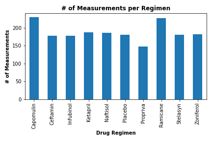
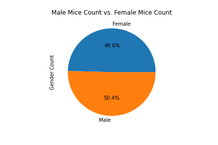
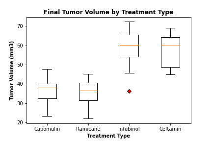
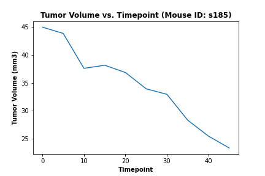
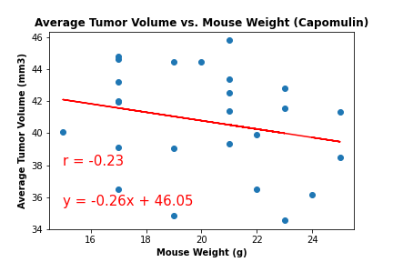

## Project Directive
Load, clean, and chart pharmaceutical data of squamous cell carcinoma (SCC) within mice.

## Data Cleaning
Utilized pandas within a Jupyter Notebook to remove duplicate mice ID's to ensure a normalized dataframe.

## Charts

